# AI Auditor: LLM-Powered Burp Scans with OpenAI, Google, Anthropic, OpenRouter, and Local LLMs
**Author**: Richard Hyunho Im ([@richeeta](https://github.com/richeeta)) at [Route Zero Security](https://routezero.security)

**Contributor**: Vinaya Kumar ([@V9Y1nf0S3C](https://github.com/V9Y1nf0S3C))


## Description
AI Auditor is an extension for Burp Suite Professional Edition and Burp Suite Enterprise Edition that integrates advanced large language models from OpenAI, Google, Anthropic, and Meta to add state-of-the-art AI capabilities to Burp Suite to enhance vulnerability scanning and analysis.

### Issues Reported by AI Auditor
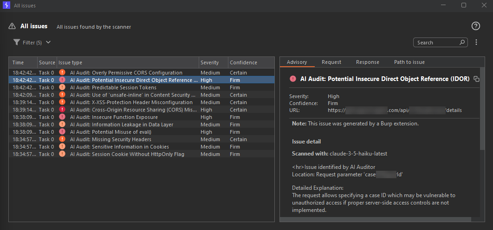

### Scan Selected Text
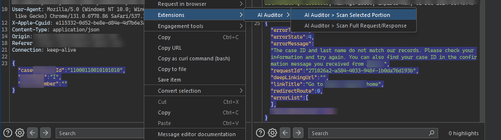

### Scan Request/Response
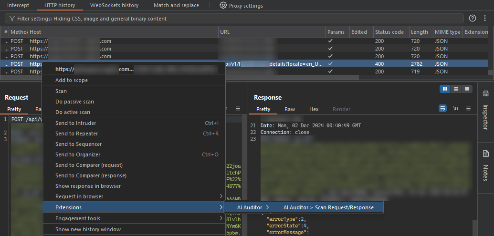


### Updates in AI Auditor v1.1 with screenshots

<details>
<summary><strong>Local LLM (LM Studio)</strong></summary>

1. Run LM Studio and ensure its IP + port are reachable from Burp Suite.  
2. Load a model in LM Studio for request/response analysis.  
3. Enter the LM Studio URL in **Burp Suite → AI Auditor → AI Configuration**.  
4. Click **Validate**—results appear in **Event Log** (lower-left).  
5. Choose **AI Model → local/local-llm (LM Studio)**.  
6. (Optional) Set the proxy to `127.0.0.1:8080` to inspect traffic.  
7. Highlight a request or text → **Right-click → Extensions → AI Auditor**.  
8. View findings in **Target → Issues** or the **Event Log**.

<kbd>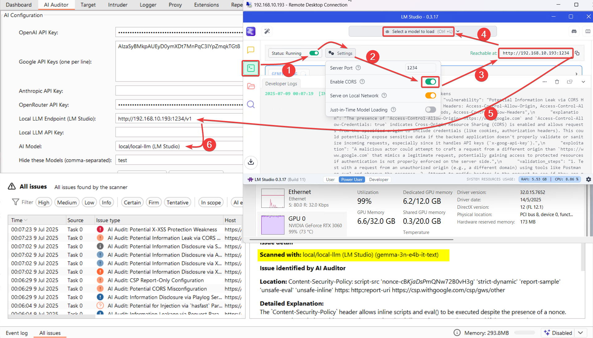</kbd>  

<kbd>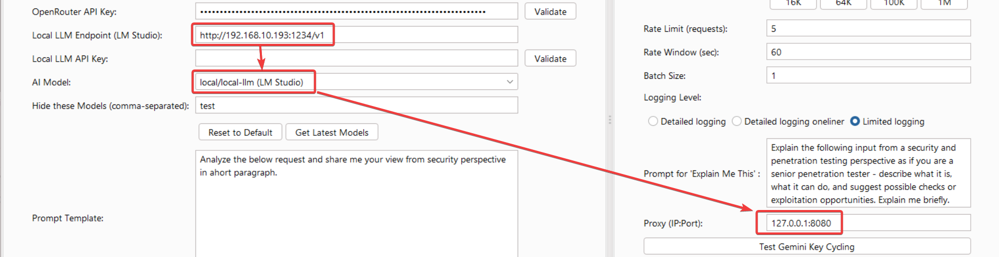</kbd>  

<kbd>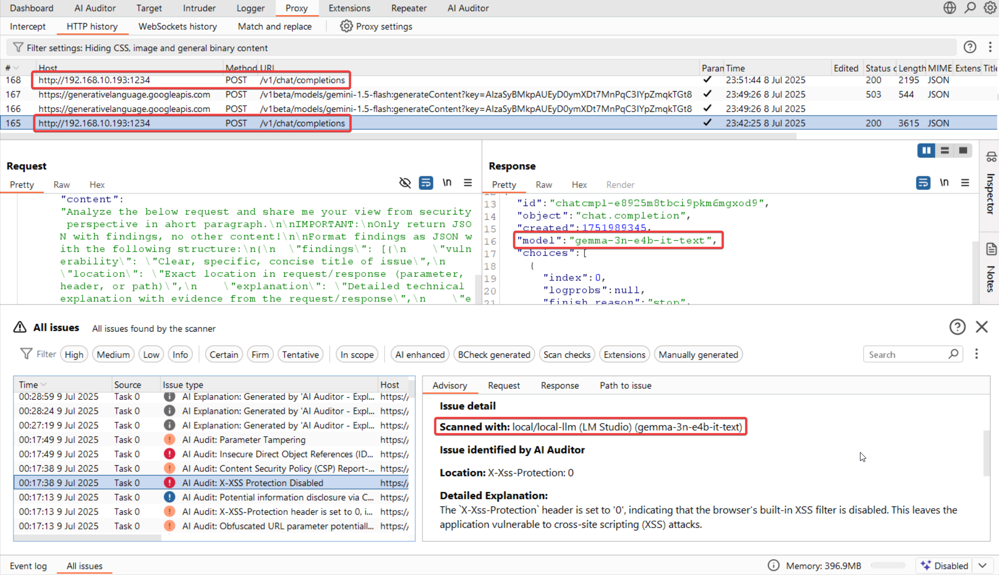</kbd>

</details>


<details>
<summary><strong>Proxying AI Auditor Traffic through Burp</strong></summary>

Configure **Proxy (IP:Port)**—e.g., `127.0.0.1:8080`—to route AI Auditor requests through Burp or another interception tool.

> *Note:* Traffic from the **Validate** button is not proxied yet.

<kbd>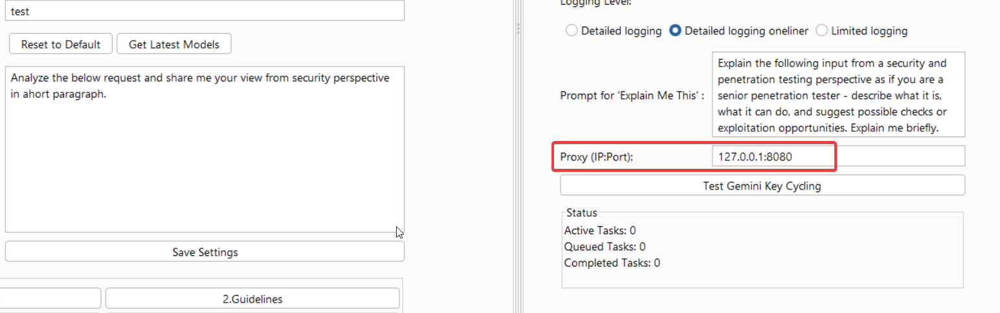</kbd>  

<kbd>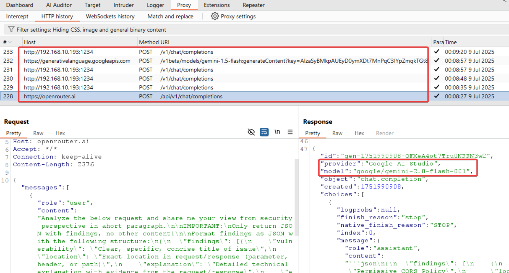</kbd>

</details>


<details>
<summary><strong>Gemini API Key Rotation</strong></summary>

1. Enter multiple Google API keys (one per line) and click **Validate**.  
2. (Optional) Click **Test Gemini Key Cycling** to simulate rotation.  
3. (Optional) Check output under **Extension** logs.  
4. During scans, keys rotate automatically on quota hits—verify in logs or proxy.

<kbd>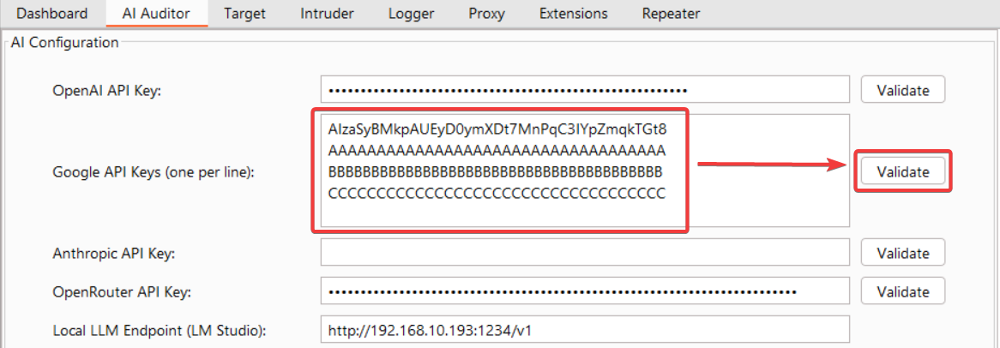</kbd>  

<kbd>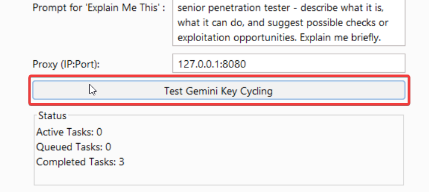</kbd>  

<kbd>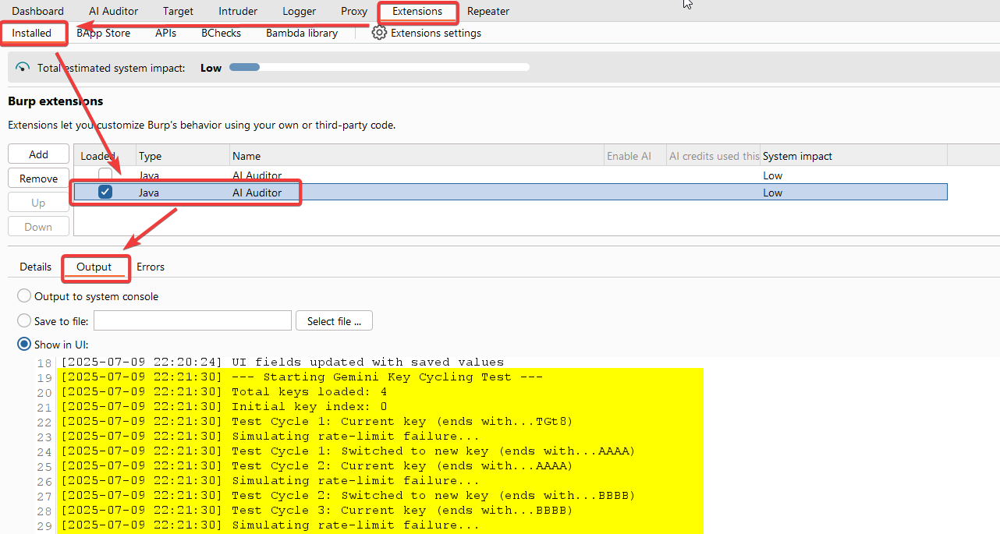</kbd>  

<kbd>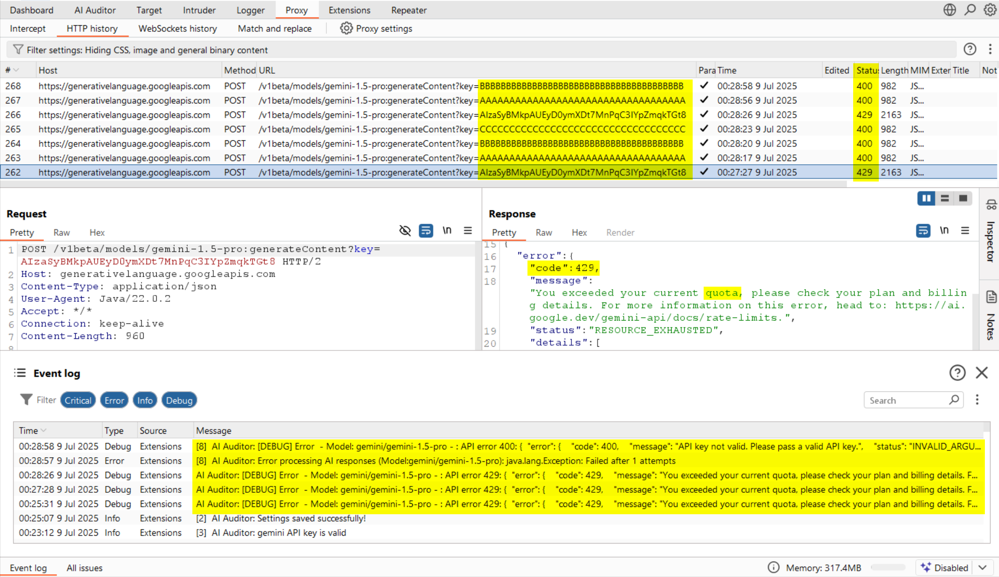</kbd>  

<kbd>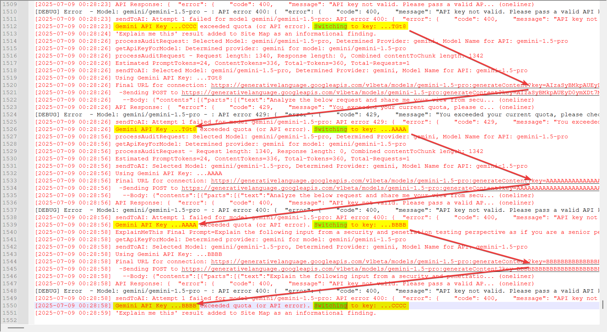</kbd>

</details>


<details>
<summary><strong>Event Log Migration</strong></summary>

Validate-operation results and many debug messages are now sent to the **Event Log** instead of pop-ups; critical errors also surface in **Extension Error Output**.

<kbd>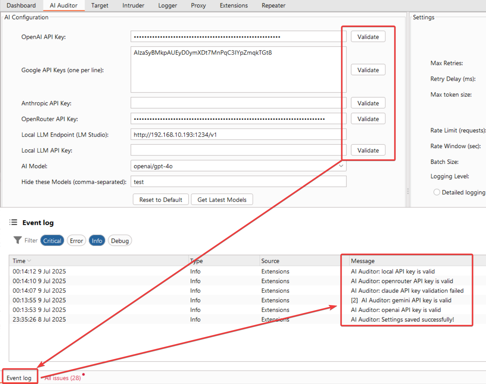</kbd>  

<kbd>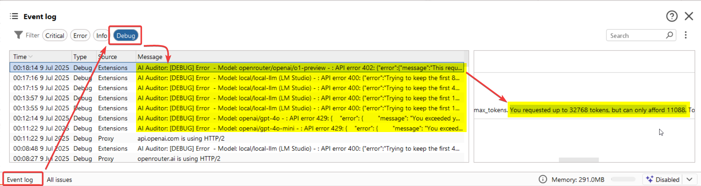</kbd>  

<kbd>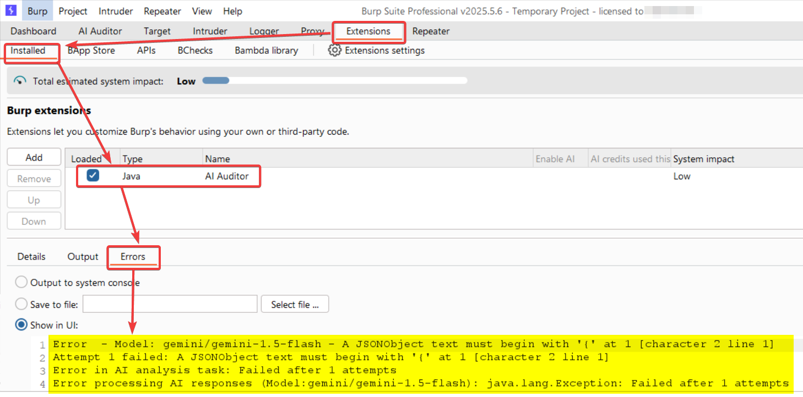</kbd>

</details>


<details>
<summary><strong>Dynamic Model Loading & Filters</strong></summary>

- Default models appear on start-up.  
- Click **Get Latest Models** to fetch new ones when APIs are set.  
- Add model names to **Hide these Models** to exclude them.

<kbd>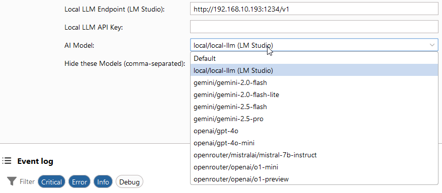</kbd>  

<kbd>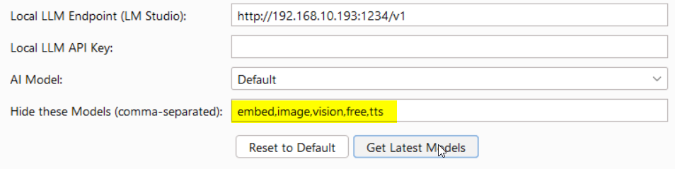</kbd>  

<kbd></kbd>  

<kbd>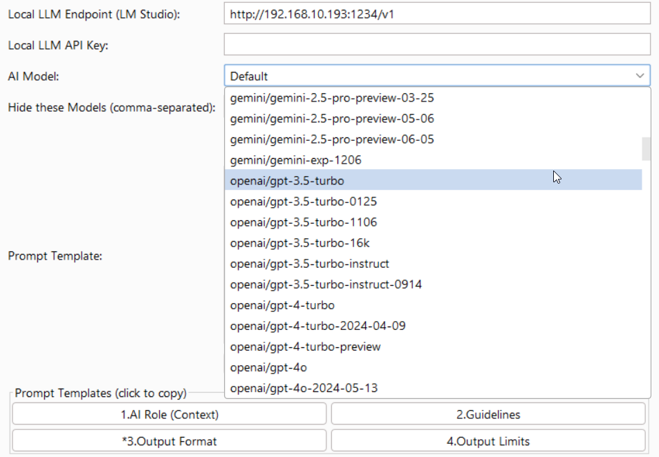</kbd>

</details>


<details>
<summary><strong>Dedicated Prompts for Analysis & “Explain Me This”</strong></summary>

Separate text boxes fir differnt prompts are are available for scanning and for the **Explain Me This** context menu; explanatory output is logged as an informational issue.

<kbd>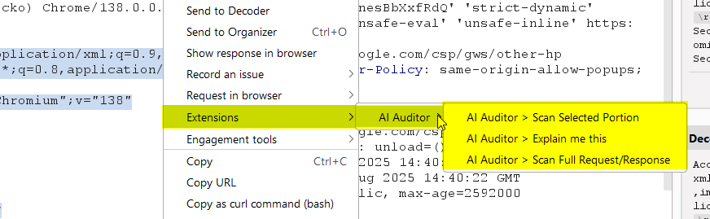</kbd>  

<kbd>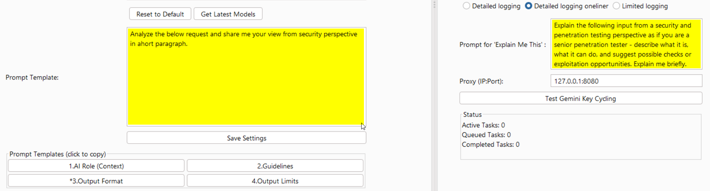</kbd>

</details>

> **Note:** A step-by-step walkthrough will be published soon on my external channels. Follow along here to get notified:
>
> * Medium: <https://vinay-infosec.medium.com/>
> * LinkedIn: <https://www.linkedin.com/in/vinay-vapt/>
>
> I’ll update this section with direct links once the articles go live.


## Features
### Core Capabilities
*   **Multi-Provider AI Integration**: **OpenAI** (`gpt-4o`, `gpt-4o-mini`, `o1-preview`, `o1-mini`), **Google Gemini** (`gemini-1.5-pro`, `gemini-1.5-flash`), **Anthropic Claude** (`claude-3-5-sonnet-latest`, `claude-3-5-haiku-latest`, `claude-3-opus-latest`), and **OpenRouter**.
*   **Local LLM Support**: Connect to a local LM Studio server for enhanced privacy and offline analysis.
*   **Dynamic Model Loading**: Automatically fetch and display the latest models from providers. Use any model compatible with the API.
*   **"Explain Me This" Feature**: Right-click selected text to get a detailed security explanation from the AI, which is then added as an informational finding in Burp's issue tracker.
*   **Detailed Vulnerability Reporting**: Vulnerability description, location, exploitation methods, severity levels (`HIGH`, `MEDIUM`, `LOW`, `INFORMATIVE`) and confidence levels (`CERTAIN`, `FIRM`, `TENTATIVE`).
*   **Custom Instructions**: Tailor the AI’s focus and analysis for special use cases.
*   **Rate Limiting**: Control the number of requests sent to APIs to avoid excessive costs.
* ~~**Context-Aware Analysis**: Configure number of requests/responses analyzed together (`0`—`5`).~~
*   **API Key Verification**: Verify API keys instantly within the extension.
*   **Integration with Burp Scanner**: Findings are automatically added to Burp’s issue tracker.
*   **Persistent Settings**: API keys and custom instructions will be saved and persist across sessions.
*   **Advanced UI Controls**:
    *   **Scrollable UI**: The main window is now scrollable, improving usability on smaller screens.
    *   **Status Panel**: Real-time monitoring of active, queued, and completed tasks.
    *   **Batch Size Control**: Tune performance by setting the number of concurrent requests (1-30).
    *   **Token Size Buttons**: Quickly set max token sizes (16K, 64K, 100K, 1M).
*   **Enhanced Logging**:
    *   **Three Logging Levels**: Choose between `Detailed`, `Detailed Oneliner`, and `Limited` logging for better troubleshooting.
    *   **Timestamped Logs**: All log entries now include a timestamp for easier analysis.
*   **Improved Workflow**:
    *   **Prompt Templates**: "Click-to-copy" buttons for common prompt sections to streamline analysis.
    *   **Gemini API Key Rotation**: Automatically cycle through multiple Gemini API keys when rate limits are hit.
    *   **Dynamic Prompt Augmentation**: Automatically adds formatting instructions to custom prompts to ensure results are correctly parsed and added to Burp's scanner.
*   **Networking & Performance**:
    *   **Proxy Support**: Route traffic through a specified proxy.
    *   **Batch Processing**: Fixed an issue with the batch pool size, now correctly processes up to 3 requests concurrently.
    *   **Token-Based Chunking**: Switched from chunk-based to token-based logic for more accurate request sizing.

## Prerequisites
### For General Usage
* **Operating System**: Windows, macOS, or Linux.
* **API Key**: A valid API key for at least one of the following:
  * [Anthropic](https://docs.anthropic.com/en/api/getting-started)
  * [Google Gemini](https://ai.google.dev/gemini/get_the_api_key) — recommended for newbies since Google offers a relatively generous free tier to use its Gemini API.
  * [OpenAI](https://platform.openai.com/docs/quickstart)
  * [OpenRouter](https://openrouter.ai/keys)
* **Burp Suite Professional Edition** or **Burp Suite Enterprise Edition**
  * **NOTE**: Burp Suite Community Edition is currently not supported.

### Additional Requirements to Build from Source
* **Java Development Kit (JDK) 17** or later
* **Apache Maven**

## Installation
### Building from Source
#### Windows
1. Install JDK 17:
```
winget install Microsoft.OpenJDK.17
```
2. Install Apache Maven:
```
winget install Apache.Maven
```
3. Clone and Build:
```
git clone https://github.com/V9Y1nf0S3C/aiauditor.git
cd aiauditor
mvn clean package
```
#### macOS
1. Install Homebrew:
```
/bin/bash -c "$(curl -fsSL https://raw.githubusercontent.com/Homebrew/install/HEAD/install.sh)"
```
2. Install JDK 17 and Maven:
```
brew install openjdk@17 maven
```
3. Clone and Build:
```
git clone https://github.com/V9Y1nf0S3C/aiauditor.git
cd aiauditor
mvn clean package
```
#### Linux (Ubuntu/Debian)
1. Install JDK 17 and Maven:
```
sudo apt update
sudo apt install openjdk-17-jdk maven
```
2. Clone and Build:
```
git clone https://github.com/V9Y1nf0S3C/aiauditor.git
cd aiauditor
mvn clean package
```

The compiled JAR will be available at `target/ai-auditor-1.1-SNAPSHOT-jar-with-dependencies.jar`.

## Installation: Loading JAR in Burp Suite (Recommended)
1. [Download](https://github.com/V9Y1nf0S3C/AIAuditor/releases/tag/v1.1) the latest version in **[Releases](https://github.com/V9Y1nf0S3C/AIAuditor/releases/tag/v1.1)**.
2. Open **Burp Suite Professional Edition** or **Burp Suite Enterprise Edition**.
3. Navigate to the **Extensions** tab.
4. Click **Add**, select **Java** as the extension type, and upload the `JAR` file.
5. Click **Next** to load the extension.

## Usage
### Initial Setup
1. Go to the AI Auditor tab in Burp Suite.
2. Enter your API key(s) for OpenAI, Gemini, Claude, and/or OpenRouter.
3. To use a local LLM, enter your LM Studio endpoint (e.g., `http://localhost:1234/v1`).
4. Click **Validate** to confirm each key/endpoint is working.
5. *Optional*: Add **Custom Instructions** to refine the analysis.
6. Save your settings.

### Analyzing Requests/Responses
#### Full Scan (Single Analysis)
1. Right-click a request or response in Burp Suite.
2. Select **Extensions** > **AI Auditor** > **Scan Full Request/Response**.

#### Analyze Selected Portion Only
1. In a request or a response, highlight the text you want to scan.
2. Right-click on your highlighted selection.
3. Select **Extensions** > **AI Auditor** > **Scan Selected Portion**.

#### Explain Me This
1. In a request or a response, highlight the text you want to understand.
2. Right-click on your highlighted selection.
3. Select **Extensions** > **AI Auditor** > **Explain me this**.
4. The explanation will be added as an informational finding in Burp's issue tracker.

### Review Results
Findings are displayed in Burp Scanner with detailed information.

## Usage Tips and Recommendations
### Avoid Scanning Large Responses
Large HTTP responses may exceed token limits and result in not only incomplete analysis but also degraded performance. Use the token size buttons to adjust the maximum token size for analysis.

### Customize Instructions Effectively
To get the best results from the AI Auditor, provide clear and specific instructions. For example:
* **Bad**: `Analyze and report everything that's bad security.`
* **Better**: `Identify and list all API endpoints found in the JavaScript file.`
* **Better**: `Only scan for XSS and SQLi. Do not scan for other issues.`

Use the "Click-to-copy" prompt templates to quickly build effective prompts.

## FAQ
**Why isn’t Burp Suite Community Edition supported?**

AI Auditor leans heavily on Burp Suite’s Scanner feature, and that’s a perk reserved for the Professional and Enterprise editions. Without it, the extension wouldn’t be able to tie findings neatly into Burp’s issue tracker or play nice with your existing workflows. It’s like trying to cook a gourmet meal on a campfire—it might work, but it won’t be pretty or efficient.

However, I am brainstorming ways to add support for Burp Suite Community Edition in the next release.

**How do I get valid API key(s) to use AI Auditor with my desired OpenAI, Google Gemini, or Anthropic model(s)?**

The steps are very easy and straightforward but a little different for each provider:
* **OpenAI (`gpt-4o`, `gpt-4o-mini`, `o1-preview`, `o1-mini`):** Follow OpenAI's [Quickstart guide](https://platform.openai.com/docs/quickstart) to sign up and generate your API key.  
* **Google (`gemini-1.5-pro`, `gemini-1.5-flash`):** Follow the instructions on Google's [Gemini API documentation](https://ai.google.dev/gemini/get_the_api_key) to set up access and retrieve your key.  
* **Anthropic (`claude-3-5-sonnet-latest`, `claude-3-5-haiku-latest`, `claude-3-opus-latest`):** Visit Anthropic's [Getting Started guide](https://docs.anthropic.com/en/api/getting-started) for detailed steps to acquire an API key.
* **OpenRouter:** Get your API key from the [OpenRouter Keys page](https://openrouter.ai/keys).

**VERY IMPORTANT**: While **AI Auditor** itself is free (you're welcome!), you are ultimately responsible for any costs incurred from using the associated APIs. Each provider has its own pricing structure, which you can find in the respective documentation for each.

For the budget-conscious, I'd recommend trying Gemini first, since Google surprisingly offers a generous free tier. (No I don't work for Google.)

**Is this extension available in the BApp Store?**

Not yet—~~but it’s on the way (hopefully)~~! I submitted it to PortSwigger for review on December 2, 2024.

**UPDATE (12/17/24):** PortSwigger has sent me this response:

> Hi Richard,
> 
> Unfortunately, we're still looking into the best way forward to integrate AI/LLM features into extensions in Burp. For now, this means that we are not able to progress your BApp Store extension submission.
> 
> We are investigating different ways to help extension authors integrate this functionality into their extensions safely and securely. When we have further details to share, we'll make sure you're at the top of the list to know.
> Please let us know if you need any further assistance.
> 
> Cheers
> 
> `REDACTED FOR PRIVACY`
>
> PortSwigger

**What should I do if I encounter bugs or crashes?**

Please open a new issue. Include as much detail as possible—what you were doing, what went wrong, and any error messages you saw. The more I know, the faster I can fix it. Feedback is invaluable, and I genuinely appreciate users who take the time to report problems.

**Why are false positives or false negatives possible?**

AI models aren’t perfect—they’re probabilistic, not deterministic. This means they rely on patterns, probabilities, and sometimes a little educated guessing. Misinterpretations can happen, especially when instructions or context are vague. To minimize these hiccups, be specific in your instructions and provide clear, relevant data. The better the input, the sharper the output. Still, it’s always a good idea to double-check the findings before acting on them.

## Disclaimer

I am providing **AI Auditor** *as-is* ***strictly*** for educational and testing purposes. By using this tool, you agree that you will do so in accordance with all applicable laws of whatever jurisdiction you're in and the terms of service for the APIs used. If you're a criminal, please don't use this tool.

## License

This project is licensed under the GNU Affero General Public License v3.0.

## Changelog & Known Issues

**NOTE**: This section will be moved into a separate changelog file with the next major release.

#### 07/09/2025: v1.1 released
*   **Local LLM Support**: Connect to a local LM Studio server for enhanced privacy and offline analysis.
*   **Dynamic Model Loading**: Automatically fetch and display the latest models from providers.
*   **"Explain Me This" Feature**: Get a detailed security explanation for selected text.
*   **Advanced UI Controls**: Scrollable UI, status panel, batch size control, and token size buttons.
*   **Enhanced Logging**: Three logging levels and timestamped logs.
*   **Improved Workflow**: Prompt templates, Gemini API key rotation, OpenRouter support, and dynamic prompt augmentation.
*   **Networking & Performance**: Proxy support, rate limiting, and token-based chunking.

#### 12/17/2024: Known Issues in v1.0
* **KNOWN ISSUE**: AIAuditor may continue to make requests even if hitting rate limits.
* **KNOWN ISSUE**: Identical issues reported by same model may fail to deduplicate.
* **KNOWN ISSUE**: Excessive false positive reports from some models (e.g., `gemini-1.5-flash`).
* **FEATURE REQUEST**: Support for locally hosted Mistral and LLaMa.

#### 12/2/2024: v1.0 released
* **CHANGED**: Default models have now been set to `gpt-4o-mini`, `claude-3-5-haiku-latest`, and `gemini-1.5-flash`.
* **FIXED**: Non-persistence of saved API keys has been addressed by replacing `PersistedObject` with `Preferences`.
* **IMPROVED**: Default instructions have been tweaked to exclude non-impactful issues and to ensure consistent JSON output that can be added to Scanner. 

#### 12/1/2024: `v1.0.1-preview` updated
* **FIXED**: Gemini and Anthropic models will now add issues to the Scanner.
* **FIXED**: Scanner formatting issues.
* **FIXED**: API key validation for Anthropic.
* **ADDED**: Additional error handling.
* **KNOWN ISSUE**: Saved API keys may not persist across Burp sessions.

#### 11/29/2024: `v1.0.1-preview` released
* **ADDED**: Ability to scan selected portion of response.
* **FIXED (partially)**: some Scanner formatting issues.
* **FIXED**: API key validation for Anthropic & Google have been fixed.
* **FIXED**: `GPT-4o`, `GPT-4o-mini`, `o1-preview`, `o1-mini` should now work and add issues properly to the Scanner.
* **FIXED (partially)**: Gemini and Anthropic models will now respond, but the responses can only be viewed in the console for now.
* **FIXED**: Implemented concurrency and other performance optimizations: should no longer freeze.
* **REMOVED**: Context-aware analysis (due to insane performance overhead).

#### 11/29/2024: `v1.0.0-preview` released
* **KNOWN ISSUE**: API key validation for Google Gemini and Anthropic may not be accurate.
* **KNOWN ISSUE**: Gemini and Claude JSON responses are not added to the Scanner.
* **KNOWN ISSUE**: OpenAI JSON responses that are added to the Scanner do not have consistent line breaks and formatting.
* **KNOWN ISSUE**: Burp Suite will temporarily freeze while waiting for the LLM to return a JSON response.
* **KNOWN ISSUE**: Model responses tend to flag a large number of low-severity or otherwise non-actionable security issues.
* **KNOWN ISSUE**: Exceeding token limits for input or output may cause Burp to crash.
* **KNOWN ISSUE**: Context-aware analysis of more than two moderately sized highlighted requests in HTTP Proxy may cause Burp to crash.
* **FEATURE REQUEST**: Ability to scan highlighted/selected portion of request/response only.
* **FEATURE REQUEST**: Support for OpenAI's `o1-mini` and `o1-preview`.
